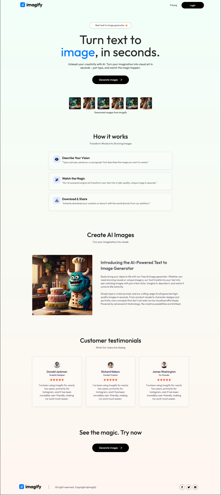
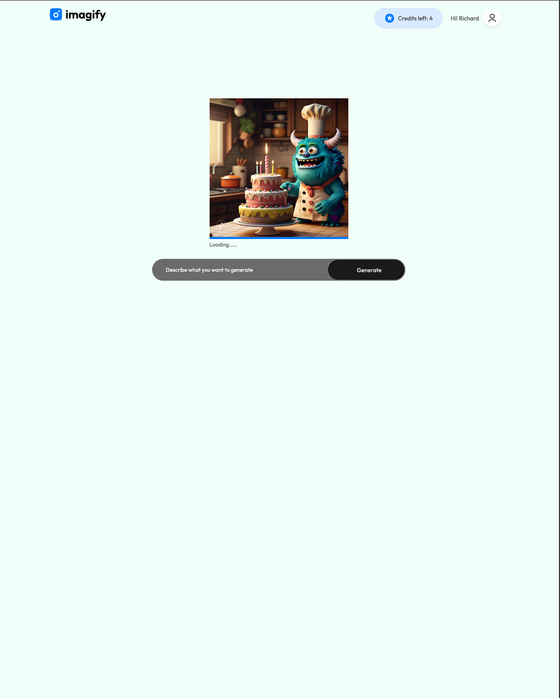
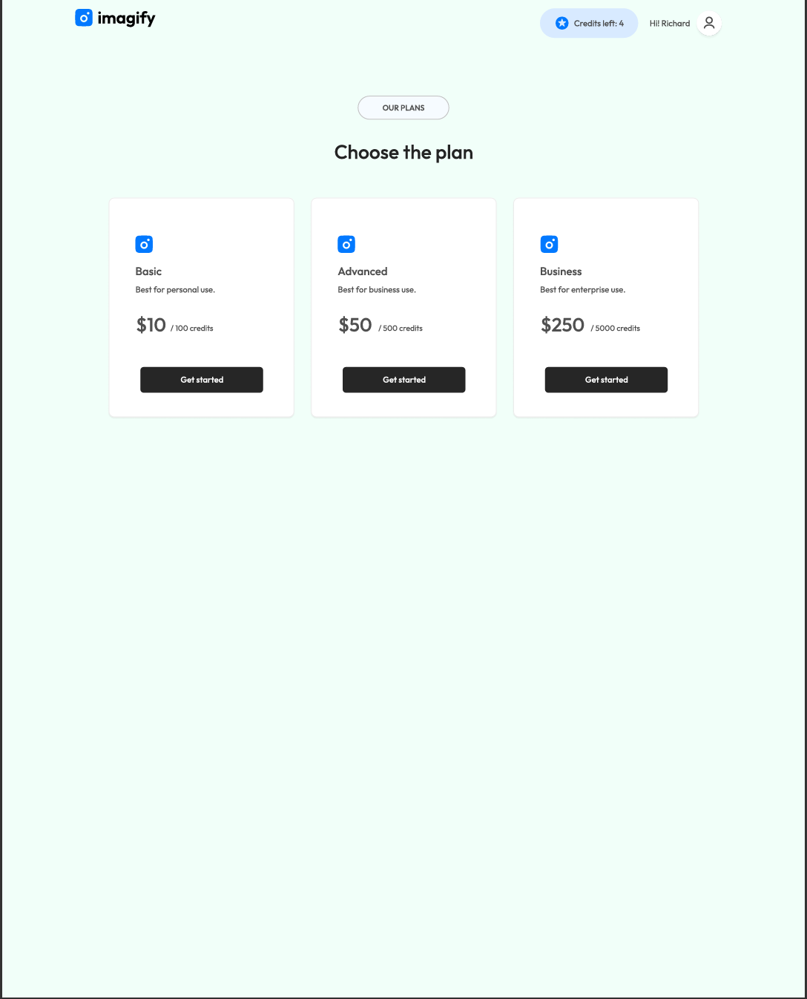
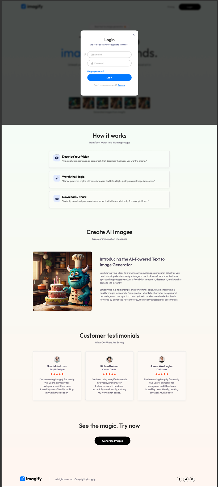

# Imagify - AI Text to Image Generator

Imagify is a full-stack web application that allows users to generate images from text prompts using AI technology. Users can manage their credits, purchase more if needed, and enjoy a seamless experience with responsive design.

## Table of Contents

- [Features](#features)
- [Demo](#demo)
- [Installation](#installation)
    - [Prerequisites](#prerequisites)
    - [Backend Setup](#backend-setup)
    - [Frontend Setup](#frontend-setup)
- [Usage](#usage)
- [Project Structure](#project-structure)
- [Technologies Used](#technologies-used)

## Features

- **User Authentication**: Register and log in securely with JWT-based authentication and password hashing.
- **Image Generation**: Generate images from text prompts using the ClipDrop API.
- **Credit System**: Manage credits for image generation; purchase additional credits when needed.
- **Responsive Design**: Built with React and Tailwind CSS for optimal viewing on all devices.
- **Toast Notifications**: Real-time feedback using `react-toastify` for success and error messages.
- **Global State Management**: Utilizes React Context API for managing user state and application-wide data.

## Demo

### Home Page 


### Generate Page 


### Pricing Page


### Login Modal 


[Download Demo PDF](Imagify%20UI.pdf) 
## Installation

### Prerequisites

- **Node.js** (v14 or higher)
- **npm** or **yarn**
- **MongoDB Atlas Account** (or local MongoDB instance)
- **ClipDrop API Key** (Sign up at [ClipDrop](https://clipdrop.co/))

### Backend Setup

1. **Clone the Repository**

   ```bash
   git clone https://github.com/yourusername/imagify.git
   cd imagify/backend
   

2. **Install Dependencies**

   ```bash
    npm install
    ```
3. **Create Environment Variables**
4. **Create a .env file in the backend directory with the following:**

   ```env
   PORT=4000
   MONGO_URI=your_mongodb_connection_string
   JWT_SECRET=your_jwt_secret
   CLIPDROP_API_KEY=your_clipdrop_api_key
   ```
   
5. **Connect to MongoDB**

   - If using MongoDB Atlas, replace `your_mongodb_connection_string` with your connection string.
   - Ensure network access and IP whitelisting are configured in MongoDB Atlas.
   - Start the Backend Server

   ```bash
   
    npm run dev
    ```
   
    The server should be running on `http://localhost:4000`.
6. **Frontend Setup**
7. **Navigate to Frontend Directory**

   ```bash
   cd ../frontend
   ```
   
8. **Install Dependencies**

   ```bash
    npm install
    ```
9. **Create Environment Variables**
10. **Create a .env file in the frontend directory with the following:**

   ```env
   VITE_APP_BACKEND_URL=http://localhost:4000
   ```
   
11. **Start the Frontend Development Server**

   ```bash
    npm run dev
    ```
   
    The application should now be running on `http://localhost:5173`.

## Usage

1. **Register or Log In**

   - Click on the Login button to open the authentication modal.
   - Switch between Sign Up and Login forms as needed.
   - Fill in the required fields and submit.
- **Purchase Credits**

   - Navigate to the Pricing page.
   - Select a plan and purchase credits.
   - (Note: Payment integration is not implemented; adjust user credits manually in the database for testing.)
   - **Generate Images**
   - Go to the Generate page.
   - Enter a text prompt describing the image you want to generate.
   - Click Generate Image.
   - If you have sufficient credits, the image will be generated and displayed.
   - Download the image if desired.
   - **Manage Credits**
   - Your current credit balance is displayed in the navbar.
   - Purchase more credits if your balance is low.


## Project Structure
  - `imagify/`
  - `backend/`
  - `controllers/` Handles logic for authentication and image generation.
  - `models/` Contains Mongoose schemas for users.
  - `routes/` Defines API endpoints.
  - `middleware/` Authentication middleware.
  - `server.js`
  - `.env`
  - `frontend/`
  - `public/`
  - `src/`
  - `assets/` Images and static assets.
  - `components/` Reusable UI components (Navbar, Footer, etc.).
  - `context/` React Context for global state management.
  - `pages/` Individual pages/routes (Home, Result, BuyCredit).
  - `assets/` Images and static assets.
  - `App.jsx`
  - `main.jsx`
  - `.env`

## Technologies Used

**Frontend:**

- React
- Tailwind CSS
- React Router DOM
- Context API
- Axios
- React Toastify
- Axios

**Backend:**

- Node.js
- Express.js
- MongoDB & Mongoose
- JWT Authentication
- Bcrypt.js
- ClipDrop API
- Cors
- Dotenv